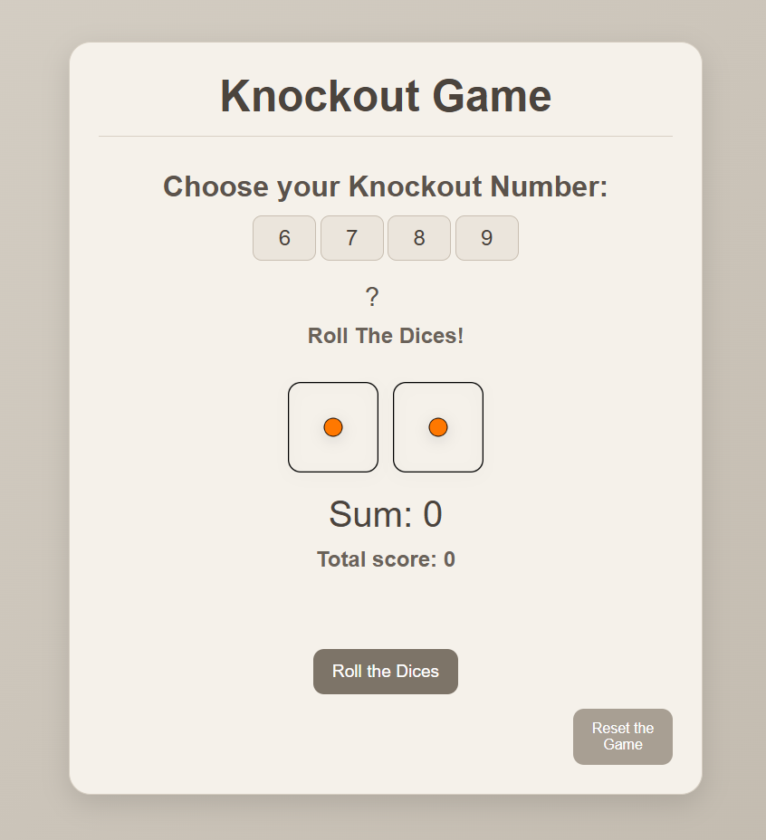
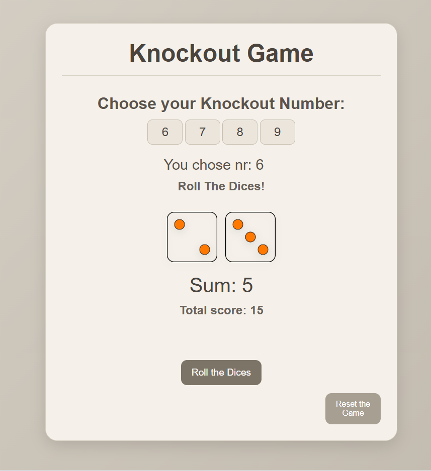
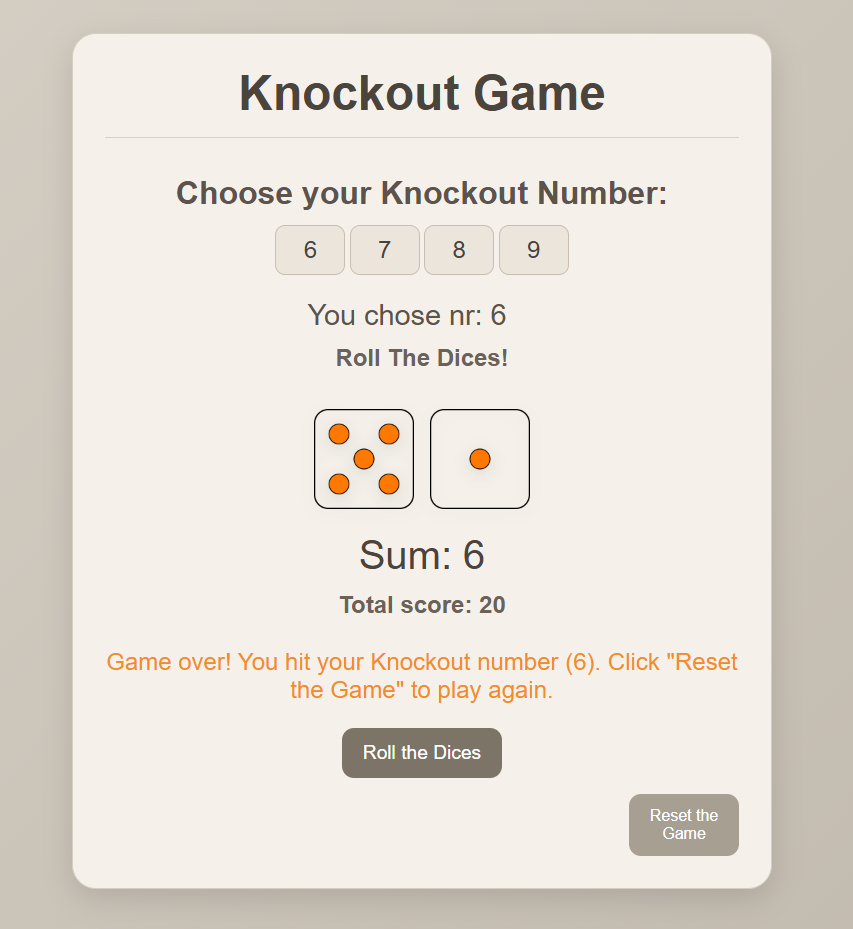

# KnockOut-Game

A simple dice game built with **HTML, CSS, and JavaScript** during a distance course in **Web Development**.

## How it works

- Choose a knockout number between 6 and 9
- Roll two dice
- If the sum matches the knockout number, the game ends
- Otherwise, the sum is added to the total score

### Start screen

### Gameplay

### Game over

## Learning purpose

This project was created as part of a web development course to practice:

- DOM manipulation
- Event handling
- JavaScript functions
- Conditional logic
- Random number generation
- Updating UI dynamically

## Technologies used

- HTML5
- CSS3
- JavaScript (Vanilla JS)
